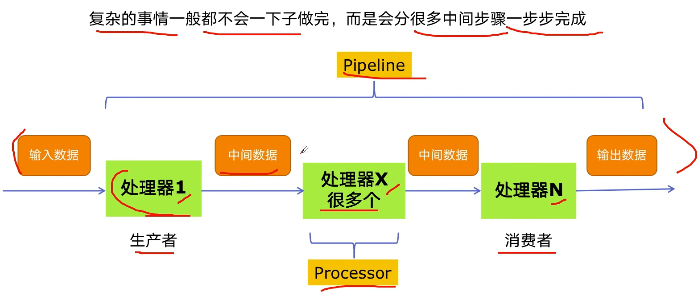
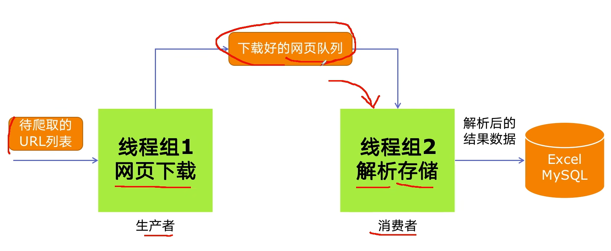

# 多组件的Pipeline技术架构

# 生产者消费者爬虫的架构

# 多线程数据通信的queue.Queue
queue.Queue可以用于多线程之间的、线程安全的数据通信
```python
# 导入类库
import queue
# 创建Queue
q = queue.Queue()
# 添加元素
q.put(item)
# 获取元素
item = q.get()
# 查询状态
# 查看元素的多少
q.qsize()
# 判断是否为空
q.empty()
# 判断是否已满
q.full()
```

# 代码实现
`blog_spider.py`文件
```python
from rich import print
from bs4 import BeautifulSoup
import requests

urls = [
    f"https://www.cnblogs.com/#p{page}"
    for page in range(1,50+1)
]

# print(urls)

def craw(url):
    r = requests.get(url)
    return r.text

def parse(html):
    # class="post-item-title"
    soup = BeautifulSoup(html, "html.parser")
    links = soup.find_all("a", class_="post-item-title")
    return [(link["href"],link.get_text()) for link in links]
```

`02_producer_consumer_spider.py`文件
```python
import queue
import blog_spider
import time
import random
import threading

def do_craw(url_queue:queue.Queue,html_queue:queue.Queue):
    while True:
        url = url_queue.get()
        html = blog_spider.craw(url)
        html_queue.put(html)
        print(
            threading.current_thread().name,f"craw{url}",
            "url_queue.size=",url_queue.qsize()
            )
        time.sleep(random.randint(1,2))

def do_parse(html_queue:queue.Queue,fout):
    while True:
        html = html_queue.get()
        results = blog_spider.parse(html)
        for result in results:
            fout.write(str(result)+"\n")
        print(
     threading.current_thread().name,"results.size=",len(results),
            "html_queue=",html_queue.qsize()
            )
        time.sleep(random.randint(1,2))

if __name__ == "__main__":
    url_queue = queue.Queue()
    html_queue = queue.Queue()
    for url in blog_spider.urls:
        url_queue.put(url)
    for idx in range(3):
        t = threading.Thread(target=do_craw,args=(url_queue,html_queue),name=f"craw{idx}")
        t.start()
    fout = open("02_data.txt","w")
    for idx in range(2):
        t = threading.Thread(target=do_parse, args=(html_queue,fout),name=f"parse{idx}")
        t.start()
```

