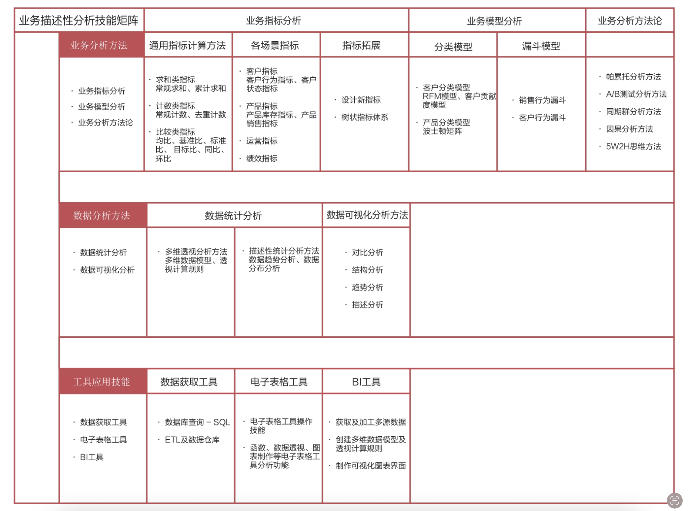
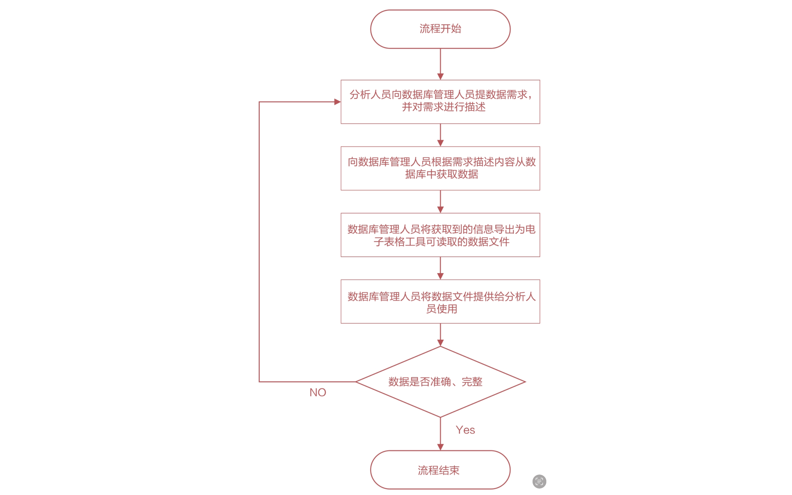

# 精益业务数据分析

## 学习目标

- 数据的基本概念
- 数据的基本操作
- 数据如何与商业结合
- 数据怎样使商业更精确
- 如何从数据的角度来全新重构商业

## 数据分析

**数据分析的概念**

>[!note]
数据分析(Data Analysis)可以被定义为：用适当的分析方法和挖掘方法对收集来的数据进行研究总结，提取有用的信息，形成结论并支持决策的过程。

“计算机的普及使保存数据变得太容易了——各种数据，不只是数字，还有图片、声音，甚至单击鼠标的行为等都被大量保存了下来。这就是大数据(Big Data)：体量巨大、来源多样、生成极快、复杂多变，并且难以用传统数据体系结构进行有效处理。而隐藏在这些数据中的信息，可能是有用的信息，却不一定能被有效地识别和利用。”

**数据分析的分类**

用于商业决策的数据分析方法分为：

- 业务描述性分析方法
- 数据发掘分析方法

业务描述性分析是以数据为分析对象，以探索数据内的有用信息为主要途径，以解决业务需求为最终目标，包含业务理解、数据采集、数据清洗、数据探索、数据可视化、数据建模、模型结果可视化、分析结果的业务应用等步骤在内的一整套分析流程。

数据挖掘是一个横跨计算机、数学、统计学等学科的科学分支。它是用人工智能、机器学习、统计学和数据库的交叉方法在相对较大型的数据集中发现信息的计算过程。数据分析的工作内容涵盖数据挖掘的工作内容。

数据分析在企业中可分为宏观分析和微观分析两大类。前者站在企业经营和运营的视角，为决策层和管理层提供数据支持；后者站在客户的视角，进行客户洞察，挖掘客户需求和匹配产品与服务，落地自动触发策略。

**数据分析的基本流程**

1. 业务理解
2. 数据获取
3. 数据处理
4. 数据分析
5. 结果展现

**业务描述性分析技能**

1. 业务分析方法
2. 数据分析方法
3. 工具应用技能

**从工作内容划分数据分析相关岗位**

**数据获取委托流程**

“并非数据库管理人员提供给分析人员使用的数据就一定是准确、完整的可用数据。因为分析人员更多的是从数据分析的使用场景及数据生成的业务场景出发向数据库管理人员进行需求描述，而数据库管理人员是站在数据库数据查询方法的技术角度理解需求的，思考的侧重点及思维模式的不同，很有可能产生相互间对问题理解上的分歧，从而造成提供过来的数据不完整或不准确的后果。为了能够尽量做到一次性获取到完整、准确的可用数据，要求分析人员在向数据库管理人员提需求时应尽量做到以下4点。

1. 需求中的业务描述部分应尽量准确、详细、易懂。

2. 需求中的数据使用部分的描述应尽量做到条理清晰、逻辑严谨、细节描述详细。

3. 需求描述结束后需要确认数据库管理人员是否听懂并且理解了需求内容。

4. 向数据库管理人员询问获取数据的方案，与数据库管理人员一起逐一核对方案细节。

