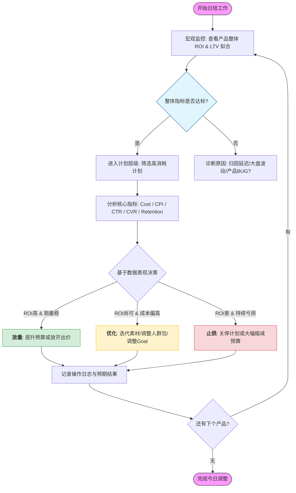

# 投放全景图

## 投放核心逻辑

从定义上来说，企业是以盈利为目的的经济组织。尽管不同企业的商业模式各不相同，但从本质上来说，都是为了盈利这个核心目的服务。

我们做广告变现也属于此列

不管怎样，我们的核心目标就是💰💰💰。

以更低的价格，买来能带来更高价值的用户。

我们买量到底买的是什么？

对于我们主要做的IAA变现来讲，我们的收益来源于别的广告主在我们的产品上打广告时，我们收取的广告费。

广告主买入用户的“注意力”，买的是该用户未来产生消费行为（LTV, 生命周期价值）的预期。如果这个用户最后下单了，广告主的这笔“投资”就收回了。

### 投放名词解释

| 简写          | 定义                                                         |
| ----------- | ---------------------------------------------------------- |
| Impressions | 展示数量                                                       |
| Click       | 点击数量                                                       |
| Install     | 安装数量                                                       |
| CTR         | Click Through Rate点击率，CTR = 点击量/展示量                        |
| CVR         | Convertion Rate 安装量/点击量                                    |
| IR          | Install Rate 安装量/展示量                                       |
| CPC         | Cost per clicks 单次点击费用                                     |
| CPA         | Cost per action 单次行为费用，这个行为可以是点击，安装，购买等                    |
| CPI         | Cost per install 单次安装费用                                    |
| CPM         | Cost per mille 千次展示费用，CPM = 广告费用/展示次数x1000                 |
| eCPM        | effective（estimated）cost per mille，有效的千次展示费用，变现侧的概念，衡量变现效率 |
| Budget      | 预算                                                         |
| Cost/Spend  | 花费，广告投放消耗的金额                                               |
| ROI         | Return Of Investment，投入产出比                                 |
| ROAS        | Return on Advertise Spend，广告支出总回报率                         |
| tROAS       | Target roas，目标roas                                         |

| 产品数据相关名词  | 定义                                             |
| --------- | ---------------------------------------------- |
| LTV       | Life Time Value 用户生命周期                         |
| Retention | 留存                                             |
| DAU       | Daily Active User 日活跃用户数量                      |
| MAU       | Monthly Active User 月活跃用户数量                    |
| UV        | Unique Visitor，独立访客                            |
| PV        | Page View，浏览的总次数                               |
| ARPU      | Average Revenue Per User，每用户平均收入，用于衡量产品收入能力的指标 |
| ARPPU     | Average Revenue Per Paid User，每付费用户平均收入        |
### 营收核心公式
$$
ROAS = \frac{LTV}{CPI}\times100\%
$$
ROAS（广告支出回报率）是投放端最为关心的指标，它表示在统计的时间窗口内，**广告带来的总收入**与**广告总支出**的比值。我们一般将180天ROAS达到100%作为KPI。

$$
ROI = \frac{\text{Total Revenue}-\text{Total Cost}}{\text{Total Cost}}\times100\%
$$

ROI（投资回报率）表示在统计的时间窗口内，**净利润**与**总投入成本**的比值。

在广告变现领域，这两个概念通常会被混用，但我们应该明白二者的区别。简单来说，ROAS衡量的广告费花得值不值，ROI衡量的是到底赚了多少钱。

### 竞价核心公式

在投放的视角，

$$
\text{CPI}=\frac{\text{cost}}{\text{install}}
$$
$$
\text{CPM}=\frac{\text{cost}}{\text{impression}}\times1000
$$
$$
\text{CTR}=\frac{\text{click}}{\text{impression}}
$$
$$
\text{CVR}=\frac{\text{install}}{\text{click}}
$$
联立上述4个式子，可得：
$$
\text{CPM}=\text{CPI}\cdot\text{CVR}\cdot\text{CTR}\times1000
$$

## 市场调研与竞争策略

### 赛道与竞争对手

- 不同品类

### 调研工具
#### appmagic

#### 点点数据

## 数据基础建设

### 归因体系

归因是什么：简单来说，归因就是买到的一个用户由谁带来。

#### Last Click规则

整个归因的基石，其实是在last click这个规则上面。在当前的广告领域，last click规则应该是最合理的规则，因为它更接近于用户的广告行为。用户看到广告点击广告下载广告到激活应用，如果是一个连贯行为，那么归因就是来自last click。而且从数据上看，大部分用户的行为都是连贯的，故在这里都认为**last click能代表用户的最后的激活**。

#### 三方归因与自归因

#### 隐私政策与SKAN
### 事件与埋点

### 变现聚合

从变现的视角，eCPM是衡量变现能力的标尺，变现端的 eCPM 是由买方（投放端）的竞争决定的。当你（变现侧）聚合了多个广告源（如 AdMob/AppLovin/Unity），系统会根据各家给出的 **预估 eCPM** 进行由高到低的排序（Waterfall）或实时竞价（Bidding）。
$$
eCPM = \frac{Ad\ Revenue}{Ad\ Impression} \times 1000
$$

聚合平台

### BI看板建设

- arpu
- cpi
- cpm
- ctr
- cvr
- ir
- 分日roi
- 分日留存

## 媒体渠道概述

### Google

### Meta

### Unity

### Applovin

### Mintegral

### Tiktok

### 其他渠道

DSP

积分墙

## 投放策略

### 优化模式

| 模式    | 全称                     | 核心目标         | 适用阶段 |
| ----- | ---------------------- | ------------ | ---- |
| MAI   | Mobile App Install     | 买安装，买最容易下载的人 | 扫量   |
| AEO   | App Event Optimization | 买行为，只要满足目标行为 |      |
| tROAS | Target ROAS            | 只看结果，能回多少钱   |      |

助攻，渠道重叠

## 创意优化

## 数据分析

### 长期ROI预测

#### 曲线拟合法

曲线拟合算法是游戏行业一种普遍的算法，这里以用30天预测180天的ROI为例，根据历史上的前180天的ROI数据得到一个拟合结果，再用这个拟合结果，根据前30天的数据预测出180天的ROI数据预测值。

线性回归模型

$$
LTV(n) = \sum_{i=1}^{n} \frac{\text{当天收入}}{\text{当天累计注册用户数}}LTV(n)=\sum_{i=1}^nr
$$

反正切函数模型

指数函数模型

幂函数模型

### ROI的拆解

在前面的内容中，我们已经知道了：
$$
ROI = \frac{LTV}{CPI}\times100\%
$$
$$
LTV = LT \times ARPU
$$
$$
ARPU = \frac{eCPM \times f}{1000}
$$
联立上面三个式子可以得到：
$$
ROI = \frac{LT \times eCPM \times f}{CPI \times 1000}\times 100\%
$$
在实际业务中，我们有不同的广告位，它们对ROI的贡献各不相同。在某些情况下，笼统地看整体 ARPU 无法满足我们的需求，我们可以将 ARPU 进一步拆解为不同广告版位的累加，即：
$$
ROI = \frac{LT \times \sum^{n}_{i=1}({eCPM}_i\times f_i)}{CPI \times 1000}\times 100\%
$$

## 工作流程

### 日常工作

## 复盘总结