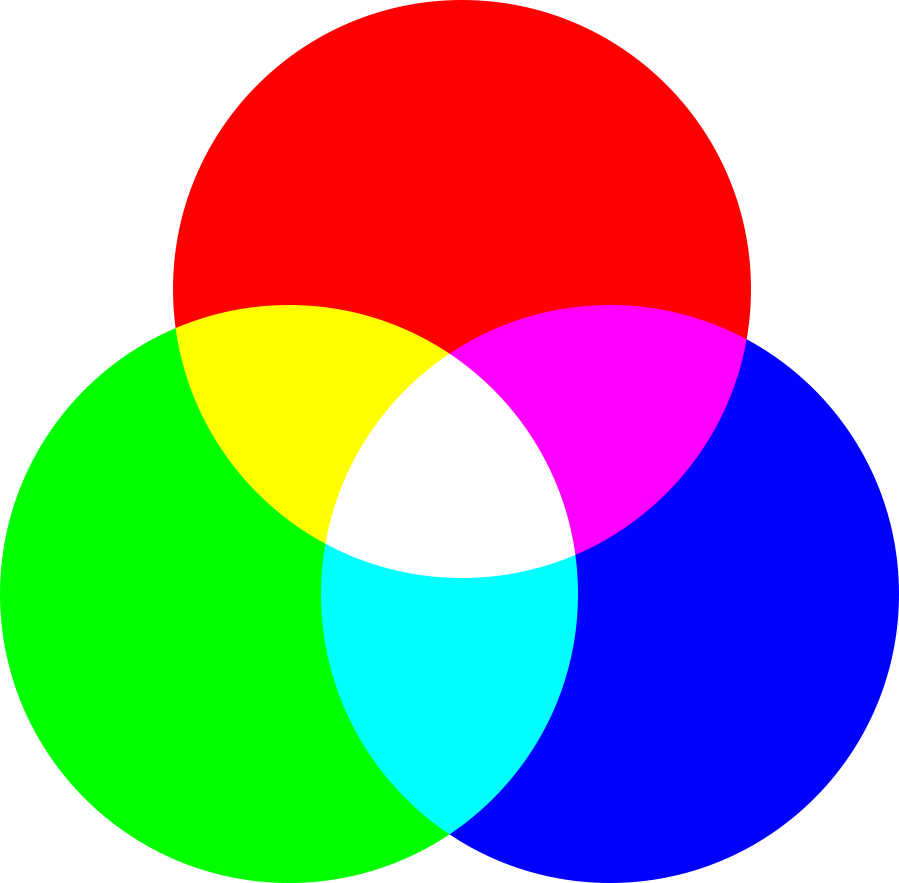
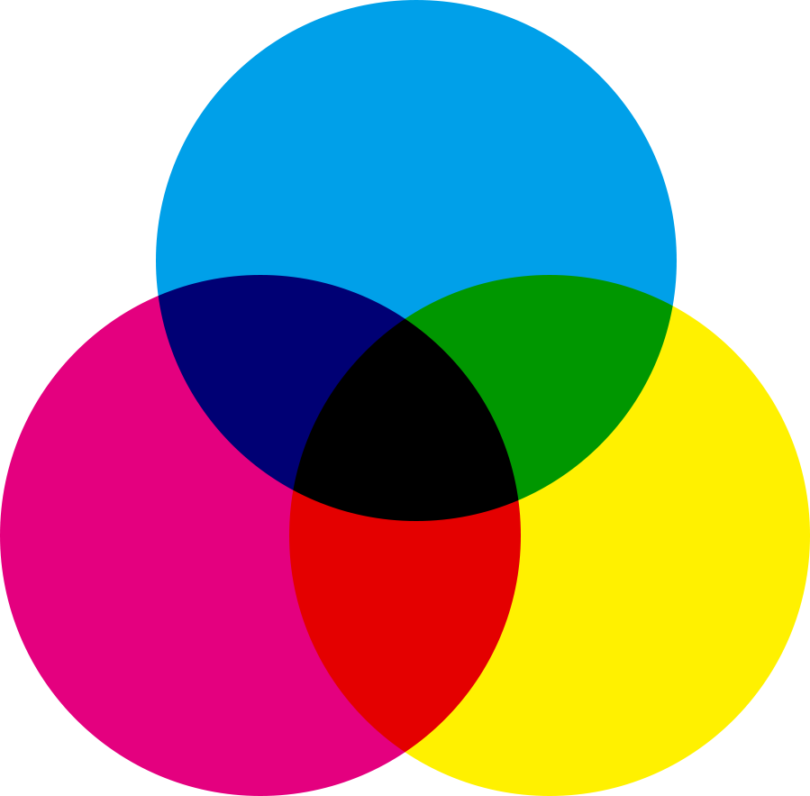

# 颜色模式

> 颜色模式是将颜色以数字形式记录和表现的数学模型，主要用于图像处理及色彩管理领域。其本质基于光线、物体与观察者的相互作用原理，通过量化光谱信息实现色彩重现。常见类型包括[RGB](https://baike.baidu.com/item/RGB/342517?fromModule=lemma_inlink)（红绿蓝三原色叠加）、[CMYK](https://baike.baidu.com/item/CMYK/888085?fromModule=lemma_inlink)（青品黄黑油墨减色）、HSB（色相/饱和度/亮度感知）和[Lab](https://baike.baidu.com/item/Lab/1514615?fromModule=lemma_inlink)（设备无关色域）等，应用于数字设计、印刷出版和屏幕显示三大场景。

## RGB（加色模式）

[RGB模式](../attachments/RGB.png)是加色模式，通过红（Red）、绿（Green）、蓝（Blue）三种颜色的叠加来产生各种颜色。主要用于电子显示设备，如电脑显示器、手机和电视等，适合数字艺术和网页设计。 

## CMYK（减色模式）

[CMYK模式](../attachments/CMYK.png)是减色模式，使用青（Cyan）、品红（Magenta）、黄（Yellow）和黑（Black）四种油墨的叠加来表示颜色。其广泛应用于印刷行业，能够更准确地模拟印刷效果，确保印刷品的颜色一致性。

## Lab模式

Lab颜色是由RGB三基色转换而来的，它是由RGB模式转换为HSB模式和CMYK模式的桥梁。该颜色模式由一个发光率（Luminance）和a、b两个颜色轴组成。它由颜色轴所构成的平面上的环形线来表示色的变化，其中径向表示色饱和度的变化，自内向外，饱和度逐渐增高；圆周方向表示色调的变化，每个圆周形成一个色环；而不同的发光率表示不同的亮度并对应不同环形颜色变化线。它是一种具有“独立于设备”的颜色模式，即不论使用任何一种监视器或者打印机，Lab的颜色不变。其中a表示从红色至绿色的范围，b表示黄色至蓝色的范围。

## HSB模式

RGB模式固然能够充分的表示颜色，但是使用起来并不符合人的直觉，因此，HSB模式应运而生。它是由RGB三基色转换为Lab模式，再在Lab模式的基础上考虑了人对颜色的心理感受这一因素而转换成的。因此这种颜色模式比较符合人的视觉感受，让人觉得更加直观一些。它可由底与底对接的两个圆锥体立体模型来表示，其中轴向表示亮度，自上而下由白变黑；径向表示色饱和度，自内向外逐渐变高；而圆周方向，则表示色调的变化，形成色环。

## 位图

位图模式用两种颜色（黑和白）来表示图像中的像素。位图模式的图像也叫作黑白图像。因为其深度为1，也称为一位图像。由于位图模式只用黑白色来表示图像的像素，在将图像转换为位图模式时会丢失大量细节，因此Photoshop提供了几种算法来模拟图像中丢失的细节。 在宽度、高度和分辨率相同的情况下，位图模式的图像尺寸最小，约为灰度模式的1/7和RGB模式的1/22以下。

## 灰度

灰度模式可以使用多达256级灰度来表现图像，使图像的过渡更平滑细腻。灰度图像的每个像素有一个0（黑色）到255（白色）之间的亮度值。灰度值也可以用黑色油墨覆盖的百分比来表示（0%等于白色，100%等于黑色）。使用黑折或灰度扫描仪产生的图像常以灰度显示。

## 索引颜色

[索引颜色模式](https://baike.baidu.com/item/%E7%B4%A2%E5%BC%95%E9%A2%9C%E8%89%B2%E6%A8%A1%E5%BC%8F/7362685?fromModule=lemma_inlink)是网上和动画中常用的图像模式，当彩色图像转换为索引颜色的图像后包含近256种颜色。索引颜色图像包含一个颜色表。如果原图像中颜色不能用256色表现，则Photoshop会从可使用的颜色中选出最相近颜色来模拟这些颜色，这样可以减小图像文件的尺寸。用来存放图像中的颜色并为这些颜色建立颜色索引，颜色表可在转换的过程中定义或在生成索引图像后修改。

> [!note]
> 在对图片进行后期时，我们常常会用到RGB，CYMK，Lab三种模式。而关于这三种颜色模式的使用技巧和使用情形，会在后面的文章进行记录。 

